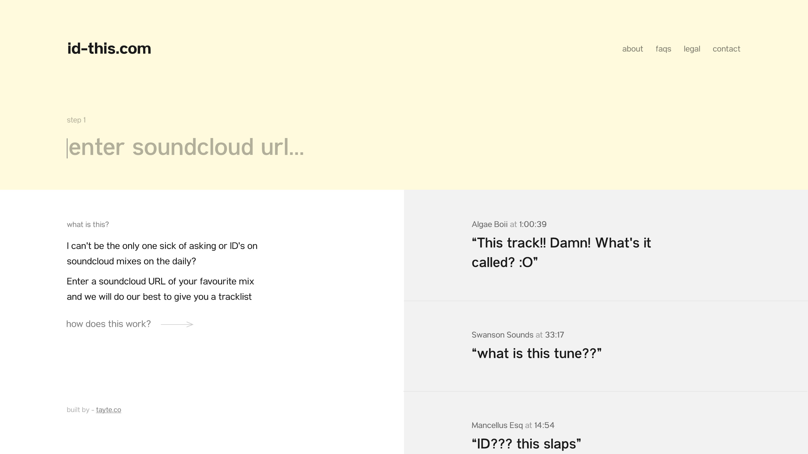

# id-this.com
**Get a tracklist from your favourite soundcloud/youtube mix**

### Try the app
https://id-this.surge.sh/
*** Currently down, API Key Expired ***

## Concept
Want a tracklist from your favourite Soundcloud/Youtube Mixes without having to shazam every song? I've been battling this for quite some time and have decided to try solve the problem myself.

The concept is simple... Put the URL of a Soundcloud/Youtube Mix into the app and receive a tracklist of every song in that mix.

## Technology & Concepts used
* React
* ExpressJS
* AudD API (Music Recognition API)
* Puppeteer
* Axios
* Heroku
* SASS

## Challenges
### Finding an API
Within the week build, it took me 4 days just to find an API that worked for me. This burnt a lot of time which should have been spent on other features.

### Running out of Call Requests
Every 18seconds of music streamed through the AudD API counted as a request. When testing hours of music in a short time frame burnt a lot of my requests. This lead to a lot down time when I couldn't test my app. 

### Learning React
With this being my first react project, I struggled but enjoyed learning the in's & out's of the framework.

### Communicating to APIs & Data Manipulation
Manipulating data to print onto my Front-End proved to be tough at times.

### State Drilling
Passing States down through nested components & calling functions on parent components from child components.

### File Structure Organisation
Haven't had enough experience with React to know what the best file structure is yet.

## WIP
* Ability to create a playlist on Spotify based off the tracklist you received.
* Performance Issues.
* Smoother UI transitions.
* Making tests.
